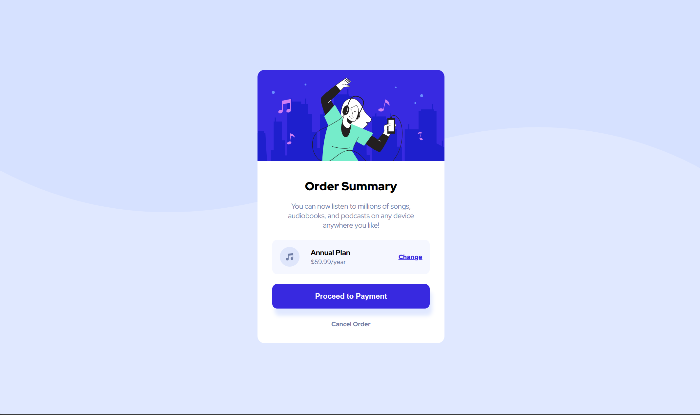

# Frontend Mentor - NFT preview card component solution

This is a solution to the [NFT preview card component challenge on Frontend Mentor](https://www.frontendmentor.io/challenges/nft-preview-card-component-SbdUL_w0U). Frontend Mentor challenges help you improve your coding skills by building realistic projects.

## Table of contents

- [Overview](#overview)
  - [The challenge](#the-challenge)
  - [Screenshot](#screenshot)
  - [Links](#links)
- [My process](#my-process)
  - [Built with](#built-with)
  - [What I learned](#what-i-learned)
  - [Useful resources](#useful-resources)
- [Author](#author)

## Overview

### The challenge

Users should be able to:

- See hover states for interactive elements

### Screenshot

### Links

- Live Site URL: [Order Summary Card](https://dathedumbguy.github.io/FEM_order_summary_card/)

## My process

### Built with

- Semantic HTML5 markup
- Flexbox
- CSS Grid(Used it once)
- Mobile-first workflow
- Media Queries

### What I learned

I'm getting used to HTML/CSS basics that I can create solutions faster than before.

### Useful resources

- [W3School](https://www.w3schools.com/) - This helped me when I forgot some syntax. I usually go here to check if I'm using the sytax correctly.

## Author

- Frontend Mentor - [@DaTheDumbGuy](https://www.frontendmentor.io/profile/DaTheDumbGuy)

- Facebook - [Daryl Bacurin](https://www.facebook.com/profile.php?id=100087293514427)
